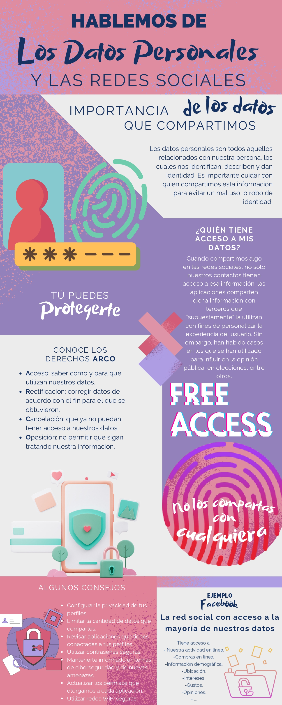

# Contenido Web - Proyecto de Divulgación en Ciberseguridad

# Infografías de la Ciberseguridad

## Creación de Contenido Educativo sobre Ciberseguridad

- **Desarrollé y publiqué dos artículos y dos infografías sobre la importancia de la ciberseguridad**.
	- Los artículos cubrieron temas como "Los datos y las redes sociales" y "La importancia de la ciberseguridad".
	- Las infografías proporcionaron visualizaciones atractivas y accesibles para los lectores, facilitando la comprensión de temas complejos.

- **Tecnologías y Herramientas Utilizadas:**
	- Canva como herramientas de diseño gráfico para crear infografías
	- Markdown para documentación
	- Git y GitHub para control de versiones y publicación
	- Google Drive para compartir documentos

- **Resultados e Impacto:**
	- **Utilicé este proyecto como una forma de aplicar y demostrar mis conocimientos en ciberseguridad, mejorando mis habilidades en la divulgación científica y la comunicación técnica**.
	- Compartí el contenido a través de plataformas como GitHub y Google Drive, recibiendo comentarios positivos y retroalimentación constructiva, pronto estarán en mi IG.

* **Estructura**.
	1. **Los datos y las redes sociales**: [Ver PDF en Google Drive](https://docs.google.com/document/d/10DyenawPkvvWHt3waOYHon-YulO3cR84jjAHlTgjZhM/edit?usp=sharing)
		- **Infografía de los datos y las redes sociales**: 
		

	2. **La importancia de la ciberseguridad**: [Ver PDF en Google Drive](https://docs.google.com/document/d/1_Zs00owgf2LBnylqP54s6Rcx-XKoGuwM9s43v2J394U/edit?usp=sharing)
		- **Infografía de la importancia de la ciberseguridad**: 
		

## La importancia de la ciberseguridad.

### ¿Por qué el creador del face tapa su webcam? ¿Alguien nos vigila? México, el país #13 más ciberatacado en el mundo, la importancia de la ciberseguridad

La ciberseguridad es la práctica de proteger cualquier dispositivo electrónico, como computadoras, celulares y servidores, de los ataques maliciosos llevados a cabo por cibercriminales, con el objetivo de resguardar tu información digital en sistemas interconectados, que procesan, almacenan o transmiten utilizando tanto defensas como tácticas ofensivas. La ciberseguridad es esencial porque protege tus datos personales y la información crítica en un mundo digital cada vez más interconectado, en otras palabras, se trata de salvaguardar la integridad y privacidad de tu información en línea de posibles amenazas cibernéticas. La reconocida empresa de ciberseguridad Kaspersky subraya la importancia de la ciberseguridad al destacar su papel fundamental en la defensa de la integridad de la información digital frente a las crecientes amenazas en el entorno mundial digital de hoy en día.

Y si no te preocupas por la ciberseguridad, podrías estar en riesgo de sufrir ataques maliciosos, los ciberataques, como el phishing (fraudes en línea), el malware (programas diseñados para infiltrarse con objetivos maliciosos), los ataques de ransomware (secuestro o encriptación de la información para luego solicitar un rescate), y las intrusiones a la privacidad, representan una amenaza significativa para la seguridad cibernética en el día a día de los usuarios de Internet. 
Imagina que subes tus fotos a tus redes sociales o historias, haces compras en línea, recibes correos electrónicos a diario o incluso trabajas desde casa; en todos estos escenarios, la ciberseguridad está presente de una forma u otra: cuando publicas o subes fotos en tus redes sociales, compartes tu vida en línea, es fundamental mantener una configuración de privacidad sólida al compartir contenido en redes sociales para que no cualquiera tenga tanta información de tí, o al realizar compras en línea, seguro que no te gustaría recibir noticias de pérdidas de dinero porque alguien tuvo acceso a tus datos, se recomienda ser cauteloso al interactuar con correos electrónicos y al conectarse a redes Wi-Fi públicas, ya que podrías ser vulnerable a ataques cibernéticos.

Los correos electrónicos a menudo pueden ser la puerta de entrada y herramienta de los ciberdelincuentes para engañar a los usuarios y obtener acceso no autorizado a su información personal o sensible, este tipo de ataque se conoce como "phishing", aquí los hackers intentan obtener tu información confidencial, como contraseñas o tus datos bancarios, tu información financiera, haciéndose pasar por entidades legítimas y oficiales en los correos electrónicos, podrías recibir correos electrónicos fraudulentos que lo único que quieren es engañarte y hacerse pasar por terceros para obtener toda nuestra información confidencial, estos ataques de phishing son muy comunes y representan una amenaza importante para la seguridad cibernética, ya que los usuarios pueden ser engañados fácilmente si no son conscientes de las señales de advertencia y las prácticas de seguridad en línea.

Por otro lado, trabajar desde casa debería implicar que la red de tu casa debe ser tan segura como la de tu oficina porque los datos personales y de tu trabajo sensibles pueden estar en riesgo si no se implementan las medidas de seguridad adecuadas en la red doméstica. Sin una red segura en el entorno doméstico, los hackers podrían aprovechar las vulnerabilidades de seguridad para acceder a tu red de internet, a tu información confidencial y así podrían comprometer tu privacidad!!! Como usuario.
Muchas personas, como Mark Zuckerberg(el creador del face) cubren sus cámaras web con un sticker como una medida de seguridad para evitar la posibilidad de que hackers o software malicioso puedan tomar el control de sus cámaras sin su consentimiento, pero, ¿Esto es paranoia? ¿Imaginas que alguien puede verte o espionarte y grabar lo que haces en tu entorno personal sin que lo sepas?¿leyenda urbana? ¿realidad? Parece terrible pensarlo pero no deja de ser una gran pregunta, ¿realmente nos pueden espiar usando nuestra webcam? Desafortunadamente el experto en tecnología Carlos Hergueta afirma tajantemente que “sí, nos pueden ver a través de las cámaras de nuestros ordenadores. Es un hecho”, ya que existen numerosos estudios sobre seguridad que han encontrado malwares (software malo) de ciberdelincuentes que se dedican a espiarnos de esa manera e, incluso, también han salido a la luz informes sobre programas de este tipo, utilizados por agencias de inteligencia, como la NSA(Agencia de Seguridad Nacional estadounidense) y la “la existencia de este tipo de softwares espía ha sido expuesta en numerosas ocasiones, por distintas compañías dedicadas a la seguridad informática”. Y no solo eso, si no que además el ex-director del FBI dice que es mejor tenerla cerrada.  Para que te des una idea de la seriedad de este problema, debes saber que el año pasado Facebook invirtió ¡13 millones de euros en medidas de seguridad! Y que méxico es el #13 país más atacado con 130,000 ataques en el día 2023-10-24.

Es cierto, quizá nosotros no tenemos esa cantidad de dinero para protegernos, pero para nuestra fortuna hay varios hábitos de seguridad digital que podemos poner en práctica, para proteger tu información personal y digital de lo antes mencionado incluso sin tener conocimientos técnicos profundos o ser un experto en tecnología. Aquí te dejo algunos consejos prácticos y fáciles para protegerte:
